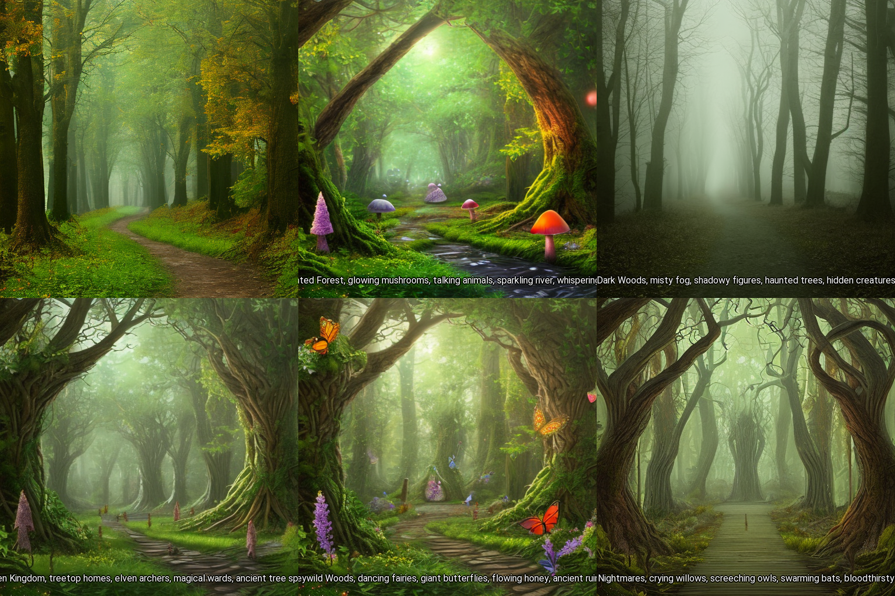
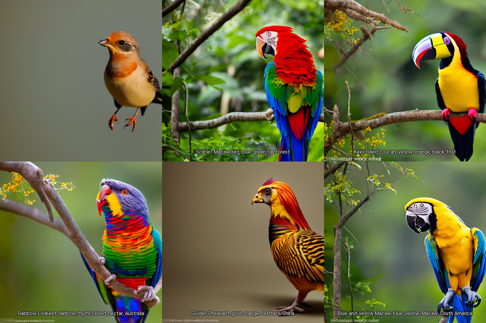
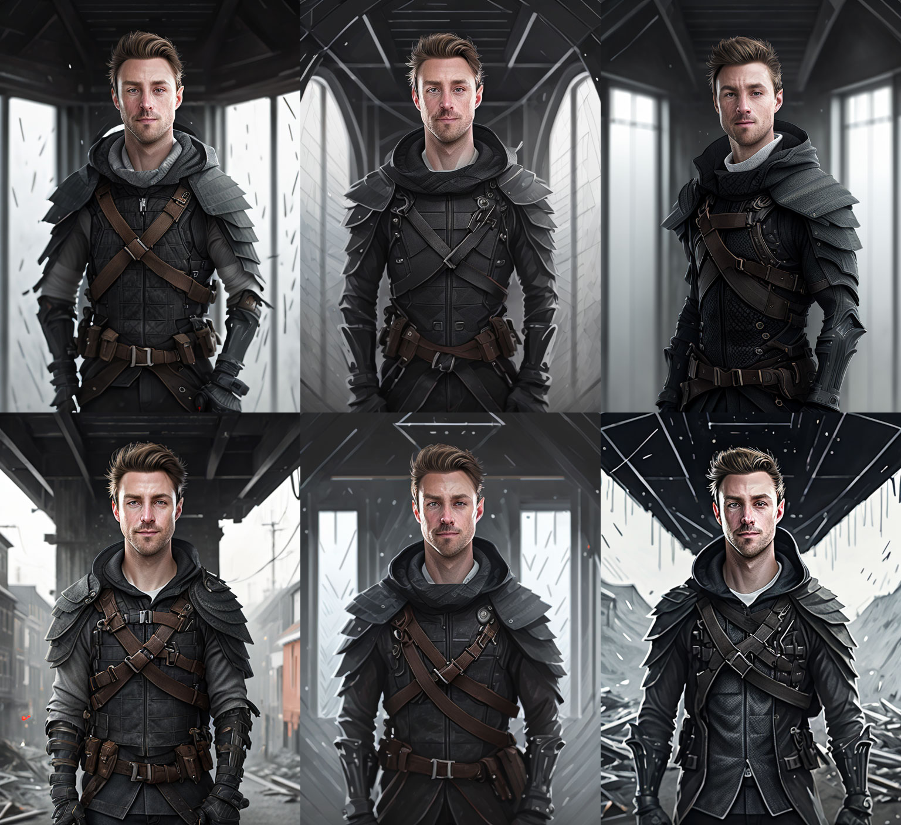

# stable-diffusion-webui-chatgpt-utilities
This an extension for [stable-diffusion-webui](https://github.com/AUTOMATIC1111/stable-diffusion-webui)

This is a set of utilities for the stable-diffusion-webui.

## Installation & Setup

- Go to the directory \<stable-diffusion-webui project path\>/extensions and run command  to install: `git clone https://github.com/hallatore/stable-diffusion-webui-chatgpt-utilities` and restart your stable-diffusion-webui.
[See here for more install details](https://github.com/AUTOMATIC1111/stable-diffusion-webui/wiki/Extensions)

- Add your OpenAI API Key in Settings/ChatGPT Utilities within the web ui. You need a paying account at  [OpenAI](https://platform.openai.com/account/billing/overview).

- Enable ChatGPT under scripts in txt2img/img2img

## Usage

**Input textbox**

Add your ChatGPT question here. It should be something that asks for variations. 
PS: {prompt} is a special key and will insert the original prompt in your ChatGPT request.

See examples further down.

**Replace prompt checkbox**

This checkbox replaces the prompt instead of appending to it. Turn this ON if you want chatGPT to return prompt variations to try out.
- OFF: "ORIGINAL_PROMPT, CHATGPT_RESPONSE"
- ON: "CHATGPT_RESPONSE"

## Examples

### Give me x variations example 1

> prompt: a forest path with trees

> chatgpt: Describe 5 unique fantasy settings given the prompt "{prompt}" with 4 keywords per item

---

### Give me x variations example 2

> prompt: a photo of a bird

> chatgpt: Give me 5 colorful tropical birds. Their names and 4 keywords

---

### Reduce prompt complexity and change sentences to keywords.

> prompt: ToreLervik-v1 as an assassin, Thin, supple black leather armor with an attached hood to conceal ToreLervik-v1's face, and forearm-length gloves equipped with hidden daggers. His boots are fitted with grappling hooks which allow him to scale walls with ease., The night is moonless and the only sound is the distant chirping of crickets. In the shadows, ToreLervik-v1 moves like a wraith, silent and deadly, stalking his prey through the abandoned city streets.

> chatgpt: Do not change the word ToreLervik-v1. Take the following prompt "{prompt}" and make 5 variations only containing 10 keywords each containing the most important parts of the prompt.

> parsed response:

    [
        "ToreLervik-v1 as assassin, black leather armor, attached hood, forearm-length gloves, hidden daggers, grappling hooks, moonless night, chirping crickets, silent, deadly",
        "ToreLervik-v1, thin black leather armor, hooded face, forearm gloves, hidden daggers, grappling hook boots, abandoned city streets, wraith-like movement, stalking prey, silent killer",
        "Assassin ToreLervik-v1, supple leather armor, concealed face, hidden daggers, grappling hook boots, moonless night, chirping crickets, deadly movements, abandoned streets, skilled hunter",
        "ToreLervik-v1, stealthy assassin, black leather armor, hooded face, hidden daggers, grappling hooks, moonless night, chirping crickets, silent stalker, abandoned city",
        "Assassin ToreLervik-v1, thin armor, hooded face, hidden daggers, grappling hooks, abandoned streets, moonless night, chirping crickets, wraith-like movement, deadly predator"
    ]

